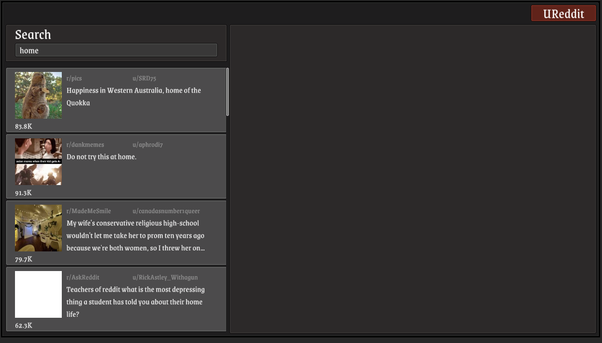

See it in action!

https://cemuka.github.io/UReddit/

# Reddit client in unity, UReddit

The main goal was the consume and use reddit api in unity. 

It lacks too many feature but I hope it would help to who wants to use in unity.

Feel free to ask and open a issue to contribute.

## License

MIT
