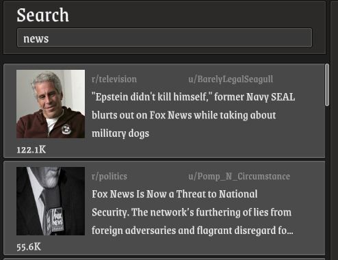

# Reddit client in unity, UReddit

The main goal was the consume and use reddit api in unity. 

* It lacks so many feature but I hope it may help to who wants to use reddit in unity.
* I couldn't use `UnityWebRequest` since reddit servers didn't respond for some reason.
* Since it's using `HttpClient`, it's not possible to use in WebGL.
* Feel free to ask and open a issue to contribute.

## License

MIT
